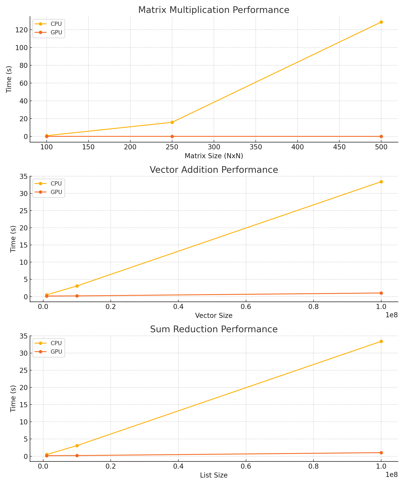

# 🚀 GPU vs CPU Performance Benchmark: Numba-Powered Speedups

This project demonstrates the performance improvements achieved by using **GPU acceleration via Numba** in Python for common numerical computations. We compare native CPU-based Python code with GPU-accelerated versions across three operations:

- Matrix Multiplication
- Vector Addition
- Sum Reduction

---

## 📌 Motivation

In high-performance computing (HPC), execution speed can become a major bottleneck—especially for data-intensive tasks. This project benchmarks the performance gap between CPU and GPU computation using **Numba**, a JIT compiler that can target CUDA-enabled GPUs for parallel execution. The experiment shows how leveraging GPU threading and memory architecture can drastically improve execution times.

---

## 📂 Project Structure

```
gpu-speedup-comparison/
├── matrix_multiplication.py       # Matrix multiplication benchmarks
├── vector_addition.py             # Vector addition benchmarks
├── sum_reduction.py               # Sum reduction benchmarks
├── gpu_vs_cpu_results.md          # Tabular benchmark results
├── gpu_vs_cpu_performance.png     # Performance graph
├── requirements.txt               # Project dependencies
└── README.md                      # This file
```

---

## 🧪 Experimental Setup

- **Environment**: Google Colab with NVIDIA T4 GPU
- **Frameworks**: Numba, NumPy, Matplotlib
- **Acceleration**: CUDA backend via Numba
- **Approach**: Time each operation on both CPU and GPU for increasing input sizes

---

## 📊 Performance Benchmarks

Benchmark results show significant performance improvements using GPU acceleration.



Detailed tables and insights are available in [gpu_vs_cpu_results.md](gpu_vs_cpu_results.md)

---

## 📈 Observations

### Matrix Multiplication
- GPU execution time remains nearly constant due to parallelism.
- CPU execution time increases exponentially with matrix size.

### Vector Addition
- GPU outpaces CPU significantly for large input vectors.
- Memory access and streaming benefit massively from GPU threading.

### Sum Reduction
- GPU accelerates aggregation through reduction kernels.
- CPU times increase linearly while GPU remains consistent.

---

## 📥 Installation

1. Clone the repo:
   ```bash
   git clone https://github.com/your-username/gpu-speedup-comparison.git
   cd gpu-speedup-comparison
   ```

2. Install dependencies:
   ```bash
   pip install -r requirements.txt
   ```

3. (Optional) Run in a GPU-enabled notebook or Google Colab for best results.

---

## ▶️ Running the Code

Each script can be run independently. For example:

```bash
python matrix_multiplication.py
python vector_addition.py
python sum_reduction.py
```

Ensure your Python environment has access to a CUDA-capable GPU for GPU results.

---

## 🧠 Key Takeaways

- **Numba** makes it extremely simple to accelerate Python code with minimal changes.
- GPU acceleration leads to **10x–1000x performance gains** depending on problem size.
- Understanding GPU memory and threading models is key to unlocking performance.

---

## 📚 References

1. [Numba CUDA Docs](https://numba.readthedocs.io/en/stable/cuda/index.html)
2. [CUDA Parallel Reduction Tutorial](https://shreeraman-ak.medium.com/parallel-reduction-with-cuda-d0ae10c1ae2c)
3. [OLCF Vector Addition Example](https://github.com/olcf-tutorials/vector_addition_cuda)

---

## 👨‍💻 Author

**Shaun Lewis**  
M.S. Computer Science, CSU Chico  
Email: sdlewis@csuchico.edu  
GitHub: [@ferrero-rocher](https://github.com/ferrero-rocher)  
LinkedIn: [Shaun Lewis](https://www.linkedin.com/in/shaun-lewis/)

---

If you're hiring for systems, ML infra, or HPC-focused roles — let’s connect!

